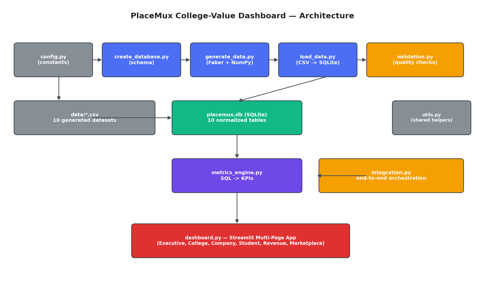

# PlaceMux College-Value Dashboard

**Phase 2 Industry Immersion Project — Task 20: Portals Integration & Dry Run**

A production-style, fully local analytics platform that integrates data
across the PlaceMux placement ecosystem — colleges, students, companies,
jobs, applications, interviews, offers, placements, payments, and
revenue — into a single Streamlit dashboard colleges can use to evaluate
placement performance, hiring outcomes, student engagement, company
participation, and overall marketplace value.



---

## Project Overview

PlaceMux connects colleges, students, and hiring companies. This project
builds the analytics layer on top of that marketplace: a normalized
SQLite database, a synthetic-but-realistic dataset generator, a metrics
engine that turns raw transactional data into KPIs, a data-validation
suite, and a six-page Streamlit dashboard.

## Folder Structure

```
placemux/
├── create_database.py       # SQLite schema (tables, FKs, constraints, indexes)
├── generate_data.py         # Faker/NumPy/Pandas synthetic dataset generator
├── load_data.py             # CSV -> SQLite bulk loader
├── dashboard.py             # Streamlit multi-page dashboard
├── metrics_engine.py        # All KPI SQL, wrapped in MetricsEngine
├── validation.py            # Data-quality checks + Markdown report
├── integration.py           # End-to-end pipeline orchestration
├── config.py                # Central configuration (paths, dataset sizes, constants)
├── utils.py                 # Shared helpers (DB connections, formatting)
├── requirements.txt
├── README.md
├── SCHEMA.md                 # Full database schema reference
├── placemux.db                # Generated SQLite database
├── data/                       # Generated CSVs (10 datasets)
└── docs/
    ├── architecture.png
    ├── workflow.md
    ├── metrics_documentation.md
    └── validation_report.md    # Generated by validation.py
```

## Installation

```bash
# 1. Create a virtual environment (recommended)
python -m venv venv
source venv/bin/activate   # Windows: venv\Scripts\activate

# 2. Install dependencies
pip install -r requirements.txt
```

## Running the Project

Run these four commands in order from the `placemux/` directory:

```bash
python create_database.py     # 1. Create the schema
python generate_data.py       # 2. Generate synthetic datasets into data/
python load_data.py           # 3. Load CSVs into placemux.db
streamlit run dashboard.py    # 4. Launch the dashboard
```

Or run the entire pipeline (schema + generation + load + validation) in
one shot with the integration script:

```bash
python integration.py
# or, to reuse already-generated CSVs:
python integration.py --skip-generation
```

The dashboard opens at `http://localhost:8501` by default.

## Database Schema

See [SCHEMA.md](SCHEMA.md) for the full entity-relationship design: 10
normalized tables, primary/foreign keys, CHECK constraints, and indexes.

## Dataset Sizes

| Table | Minimum (per brief) | Typical generated volume |
|---|---|---|
| Colleges | 100 | 100 |
| Students | 5,000 | 5,000 |
| Companies | 1,000 | 1,000 |
| Jobs | 4,000 | 4,000 |
| Applications | 20,000 | 20,000 |
| Interviews | 8,000 | 8,000 |
| Offers | 3,500 | ~4,300 |
| Placements | 3,000 | 3,000 |
| Payments | 4,000 | 4,000 |

Funnel counts (offers, placements) are generated slightly above their
floor because they're sampled from upstream conversion rates (interview
passes, offer acceptances) — exact counts vary slightly with the random
seed but always clear the required minimums.

## Dashboard Features

Six pages, each with Plotly visualizations and sidebar filters (college,
department, batch year, placement status, salary range):

1. **Executive Summary** — KPI cards, placement trend, marketplace funnel, top colleges.
2. **College Dashboard** — placement rate, salary distribution, top hiring companies, department performance, placement trend.
3. **Company Dashboard** — hiring funnel (applications → interviews → offers → joins), conversion by industry, top companies by hires.
4. **Student Dashboard** — placement status, skills breakdown, salary distribution, per-student interview history lookup.
5. **Revenue Dashboard** — revenue trend, revenue by college/company, payment status breakdown.
6. **Marketplace Health** — conversion funnel, applications-vs-placements heatmap by department, liquidity metrics (jobs-to-seekers ratio).

## KPIs

Full formulas for every metric are documented in
[docs/metrics_documentation.md](docs/metrics_documentation.md). Highlights:

- **College**: Placement Rate, Offer Acceptance Rate, Avg/Median/Highest/Lowest Salary, Students Awaiting Placement.
- **Company**: Active Recruiters, Companies Hiring, Avg Hires/Company, Offer & Interview Conversion.
- **Student**: Applications/Student, Interview/Offer/Placement Success Rates.
- **Revenue**: Total Revenue, Revenue by College/Company, Payment Success Rate.

## Data Validation

`validation.py` checks for missing data, duplicate records, invalid
salary values, broken foreign keys, and business-rule violations (e.g. a
placement predating its own offer). Run it directly for a fresh report:

```bash
python validation.py
```

This writes `docs/validation_report.md`. On the current generated
dataset, all checks pass (0 broken foreign keys, 0 duplicates, 0 invalid
salaries).

## Sample Screenshots

_Placeholders — replace with actual screenshots after running
`streamlit run dashboard.py` locally:_

- `docs/screenshot_executive_summary.png`
- `docs/screenshot_college_dashboard.png`
- `docs/screenshot_company_dashboard.png`
- `docs/screenshot_revenue_dashboard.png`

## Deployment Instructions

**Local:** `streamlit run dashboard.py` (see Running the Project above).

**Streamlit Community Cloud:**
1. Push this repository to GitHub (include `placemux.db` or run the
   pipeline via a build step, since Streamlit Cloud containers are
   ephemeral).
2. Connect the repo at share.streamlit.io, set the main file to
   `dashboard.py`.
3. Add a `requirements.txt` (already included) so the platform installs
   dependencies automatically.

**Docker (optional):**
```dockerfile
FROM python:3.11-slim
WORKDIR /app
COPY . .
RUN pip install -r requirements.txt
RUN python create_database.py && python generate_data.py && python load_data.py
EXPOSE 8501
CMD ["streamlit", "run", "dashboard.py", "--server.address=0.0.0.0"]
```

## Tech Stack

Python · SQLite · Pandas · Streamlit · Plotly · Faker · SQL · NumPy

## Task 20 Status

✅ College-value dashboard is live and demoable — schema created, data
generated and loaded, validation passing, and the six-page Streamlit
dashboard runs end-to-end against the real SQLite database.
